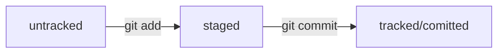

# Тренировочный репозиторий для изучения Git
## Основные команды работы с репозиторием
`git init` - инициализация репозитория  
`git status` - посмотреть состояние репозитория  
`git add` - подготовка файлов к коммиту (add to staging area)  
`git clone` - клонировать репозиторий

`git commit -m <MESSAGE>` - создание коммита  
`git commit --amend --no-edit` - добавить изменения к последнему коммиту  
`git commit --amend -m <MESSAGE>` - изменить сообщение последнего коммита  

`git log` - посмотреть историю коммитов  
`git push` - отправить изменения на удаленный репозиторий  
`git pull` - забрать изменения из удалённого репозитория

## Основные команды работы с ветками
`git branch` - посмотреть ветки репозитория   
`git branch <NAME>` - создать ветку  
`git branch -D <BRANCH_NAME>` - удалить ветку (-d более безопасный вариант)  

`git checkout <BRANCH_NAME>` - переключиться на другую ветку  
`git checkout -b <BRANCH_NAME>` - создать и переключиться на новую ветку 

`git merge <BRANCH_NAME>` - выполнить слияние текущей ветки и BRANCH_NAME  
`git push -u origin <BRANCH_NAME>` - запушить ветку  

## Привязка удалённого репозитория к локальному
`git remote add origin <LINK REPO>` - привязка  
`git remote -v` - проверка

## «Откат» файлов и коммитов
`git restore <FILE>` - откат файла к последней закоммиченной версии  
`git restore --staged <FILE>` - перевод файла из staged в untracked / modified  
`git reset --hard <HASH_COMMIT>` - возврат к указанному коммиту с удалением  

## Просмотр изменений
`git diff` - показать изменения в modified зоне  
`git diff <HASH_1> <HASH_2>` - показать разницу между двумя коммитами (ветками)  
`git diff --staged` - показать изменения, которые добавлены в staged-файлах  

Символ `~` - суффикс навигации.  
В Git есть суффикс навигации ~N, где N — это число. Он отсчитывает от заданного коммита N коммитов назад во времени.   
Нумерация начинается с нуля: `commit~0` — это сам коммит, `commit~1` — предыдущий, `commit~2` — предшествующий предыдущему и так далее.

## Создание и привязка SSH-ключа
`ssh-keygen -t ed25519 -C <GITHUB_EMAIL>` - генерация ключа  
`clip < ~/.ssh/id_ed25519.pub` - копирование содержимого ключа  
`ssh -T git@github.com ` - проверка

## Что такое Hash?
Хеширование (от англ. hash, «рубить», «крошить», «мешанина») — это способ преобразовать набор данных и получить их «отпечаток» (англ. fingerprint).  

Информация о коммите — это набор данных: когда был сделан коммит, содержимое файлов в репозитории на момент коммита и ссылка на предыдущий, или родительский (англ. parent), коммит.

Git хеширует (преобразует) информацию о коммите с помощью алгоритма SHA-1 (от англ. Secure Hash Algorithm — «безопасный алгоритм хеширования») и получает для каждого коммита свой уникальный хеш — результат хеширования.

Git хранит таблицу соответствий хеш → информация о коммите. Если вы знаете хеш, вы можете узнать всё остальное: автора и дату коммита и содержимое закоммиченных файлов. Можно сказать, что хеш — основной идентификатор коммита.

## О файле HEAD
Файл HEAD (англ. «голова», «головной») — один из служебных файлов папки .git. Он указывает на коммит, который сделан последним (то есть на самый новый).

Когда вы делаете коммит, Git обновляет refs/heads/master — записывает в него хеш последнего коммита. Получается, что HEAD тоже обновляется, так как ссылается на refs/heads/master.

Если нужно передать последний коммит, то вместо его хеша можно просто написать слово HEAD — Git поймёт, что вы имели в виду последний коммит.

## Статусы файлов

