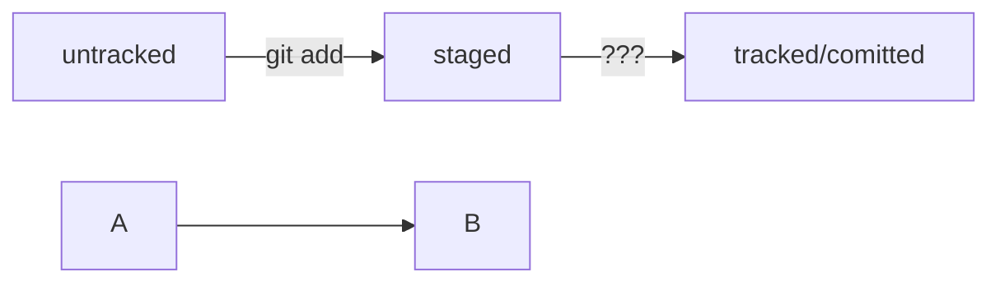

# Тренировочный репозиторий для изучения Git
## Основные команды работы с репозиторием
`git init` - инициализация репозитория  
`git status` - посмотреть состояние репозитория  
`git add` - подготовка файлов к коммиту (add to staging area)  
`git commit -m "MESSAGE"` - создание коммита  
`git log` - посмотреть историю коммитов  
`git push` - отправить изменения на удаленный репозиторий

## Привязка удалённого репозитория к локальному
`git remote add origin "SSH-LINK REPO"` - привязка  
`git remote -v` - проверка

## Создание и привязка SSH-ключа
`ssh-keygen -t ed25519 -C "GITHUB EMAIL"` - генерация ключа  
`clip < ~/.ssh/id_ed25519.pub` - копирование содержимого ключа  
`ssh -T git@github.com ` - проверка

## Что такое Hash?
Хеширование (от англ. hash, «рубить», «крошить», «мешанина») — это способ преобразовать набор данных и получить их «отпечаток» (англ. fingerprint).  

Информация о коммите — это набор данных: когда был сделан коммит, содержимое файлов в репозитории на момент коммита и ссылка на предыдущий, или родительский (англ. parent), коммит.

Git хеширует (преобразует) информацию о коммите с помощью алгоритма SHA-1 (от англ. Secure Hash Algorithm — «безопасный алгоритм хеширования») и получает для каждого коммита свой уникальный хеш — результат хеширования.

Git хранит таблицу соответствий хеш → информация о коммите. Если вы знаете хеш, вы можете узнать всё остальное: автора и дату коммита и содержимое закоммиченных файлов. Можно сказать, что хеш — основной идентификатор коммита.

## О файле HEAD
Файл HEAD (англ. «голова», «головной») — один из служебных файлов папки .git. Он указывает на коммит, который сделан последним (то есть на самый новый).

Когда вы делаете коммит, Git обновляет refs/heads/master — записывает в него хеш последнего коммита. Получается, что HEAD тоже обновляется, так как ссылается на refs/heads/master.

Если нужно передать последний коммит, то вместо его хеша можно просто написать слово HEAD — Git поймёт, что вы имели в виду последний коммит.

## Статусы файлов

